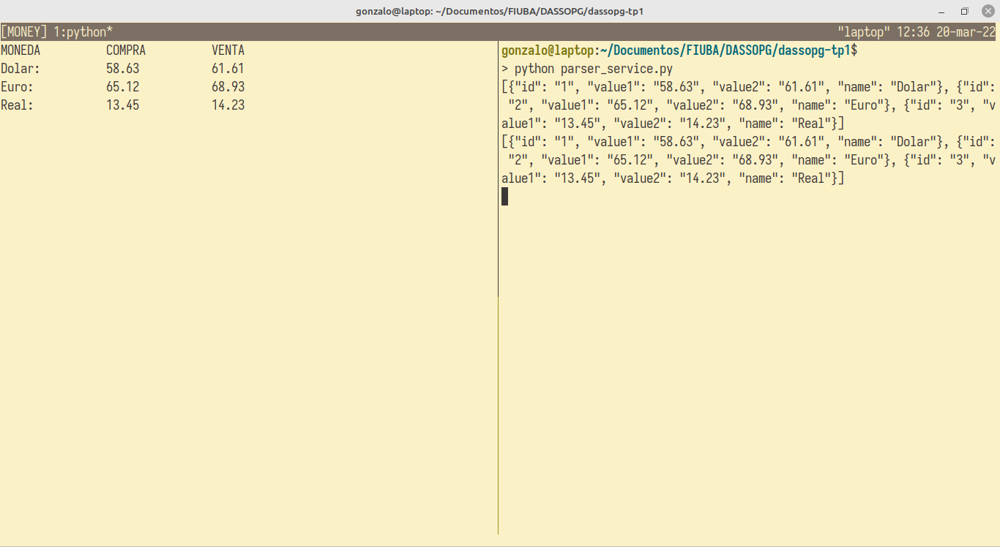

# dassopg-tp1

Gonzalo Nahuel Vaca <vacagonzalo@gmail.com>

## Introducción

Este proyecto fue realizado en el marco de la especialización en sistemas embebidos de la Universidad de Buenos Aires.

## Instrucciones

1. Descargar el repositorio
2. Ejecutar el comando `python pizarra_service.py 10000`
3. En otra terminal ejecutar el comando `python parser_service.py`
